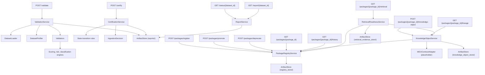
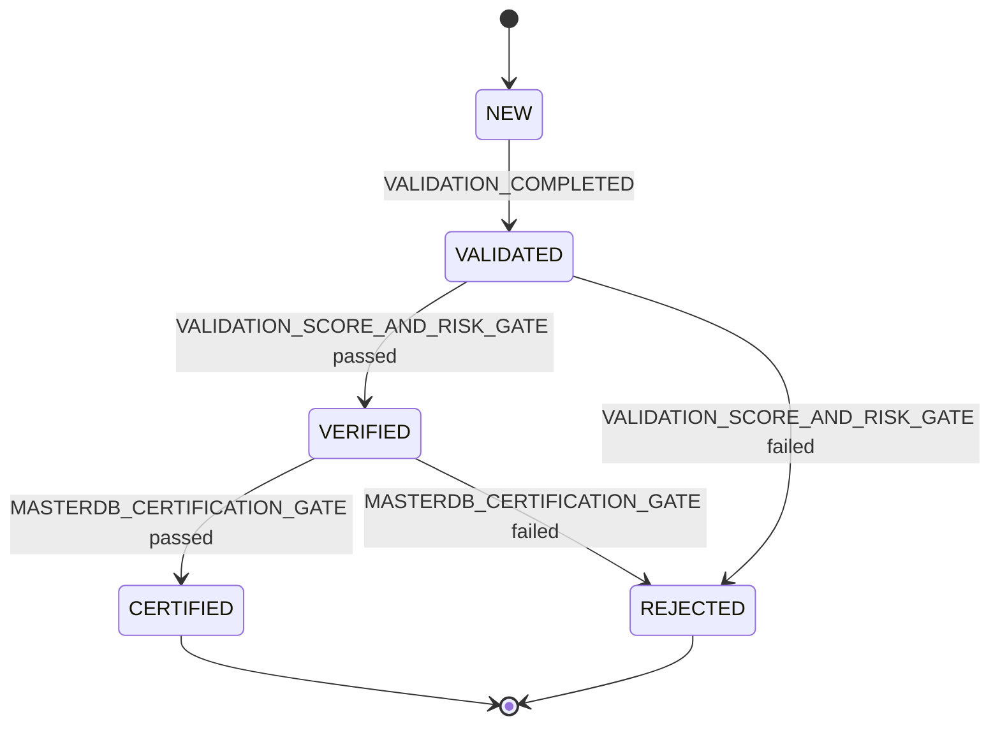
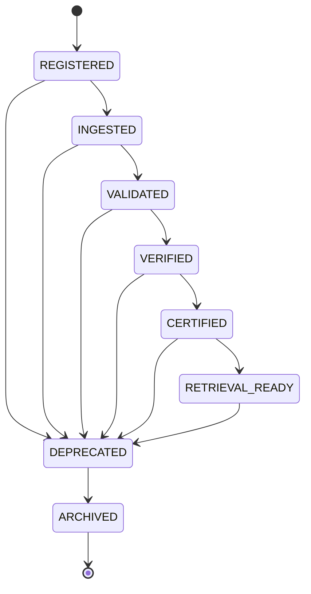
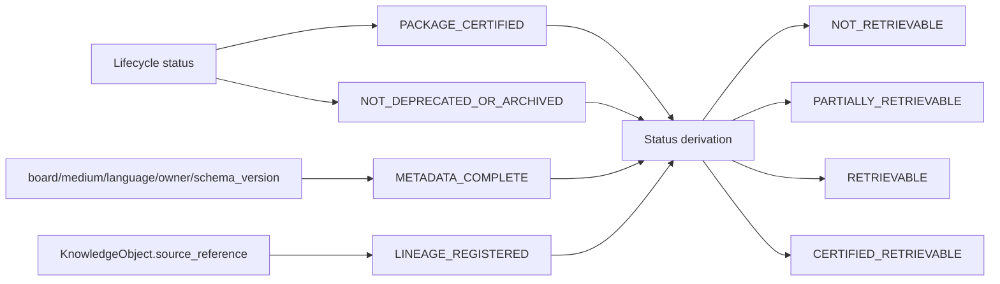

# Architecture

## Service Boundary

MASTERDB is the canonical knowledge platform runtime for the BHIV ecosystem.
It owns dataset validation/certification, Knowledge Package Lifecycle,
Dataset Registry, Package Identity, Knowledge Object/Provenance consumption,
and Retrieval Readiness/Evidence. It does not own canonical schemas,
ontology, knowledge authority, governance, runtime reasoning, embeddings, or
vector databases — those are owned by MDU (Nupur) and downstream reasoning
systems. See `MDU_INTERFACE_CONTRACT.md` for the consumption boundary.

## Components

## Data Flow — Validation & Certification

1. Caller submits a dataset package path and metadata path to `/validate`.
2. `ValidationService` loads schema, rules, metadata, and dataset rows.
3. Validators produce deterministic check results.
4. Engines calculate risk flags, integrity score, classification, and recommendations.
5. `ArtifactStore` persists the report by `dataset_id`.
6. Caller submits `/certify`.
7. `CertificationService` applies auditable state transition rules.
8. The service returns `eligible_for_masterdb=true` only for `CERTIFIED` datasets.

## Data Flow — Knowledge Package Lifecycle & Retrieval Readiness

1. Caller registers a `KnowledgePackage` via `/packages/register`, receiving
   a `package_id` and an initial `REGISTERED` transition record.
2. Caller promotes the package through `/packages/promote`;
   `PackageRegistryService` checks the requested edge against
   `PACKAGE_LIFECYCLE_GRAPH`, rejects illegal hops, and appends a
   timestamped, attributed `PackageTransition` on success.
3. Optionally, a `KnowledgeObject` is registered via
   `/packages/{package_id}/knowledge-object`, carrying `source_reference`,
   `lineage_reference`, and `derivation_path`. `KnowledgeObjectService`
   validates the declared parent exists, checks major-version schema
   compatibility, and keeps parent/child relationships in sync. Field
   semantics are consumed through `MDUContractAdapter`, a placeholder
   pending MDU's finalized contract.
4. `/packages/{package_id}/lineage` walks the `KnowledgeObject` parent chain
   to return ancestors and declared descendants.
5. `/packages/{package_id}/retrieval` runs `RetrievalReadinessService`,
   which evaluates lifecycle status, deprecation, metadata completeness, and
   lineage presence to produce a `RetrievalEvidence` artifact — persisted
   and replayable — with a `RetrievalStatus` and corrective actions for any
   failed rule.
6. `PackageRegistryService.replay()` independently rebuilds a package's
   status from its full transition history to detect drift between stored
   state and the audit trail that justifies it.

## State Machines

### Certification (existing)

### Knowledge Package Lifecycle (new)

`ARCHIVED` is terminal — no outgoing edges. `DEPRECATED` is reachable from
every non-terminal state so a package can be withdrawn at any point in its
life, and is the only path into `ARCHIVED`.

### Retrieval Readiness Rule Evaluation

## Determinism

- Rules live in `config/validation_rules.json`.
- Schema expectations live in `config/schema.json`.
- Every certification transition is appended to `audit_trail`.
- Every lifecycle transition is appended to a package's `history` with
  actor, reason, and timestamp, and is rejected if not present in
  `PACKAGE_LIFECYCLE_GRAPH`.
- Retrieval readiness assessments are recomputed deterministically from
  current lifecycle status and knowledge object state, and persisted as
  replayable evidence.
- Reports/records are persisted under `reports/`, `registry_store/`,
  `knowledge_object_store/`, and `retrieval_evidence_store/` respectively.
- API responses are JSON-only.

