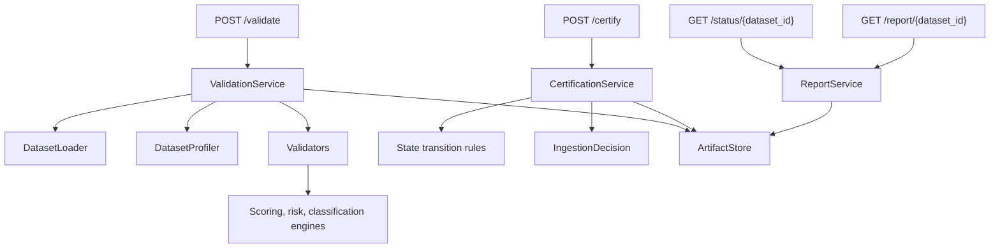
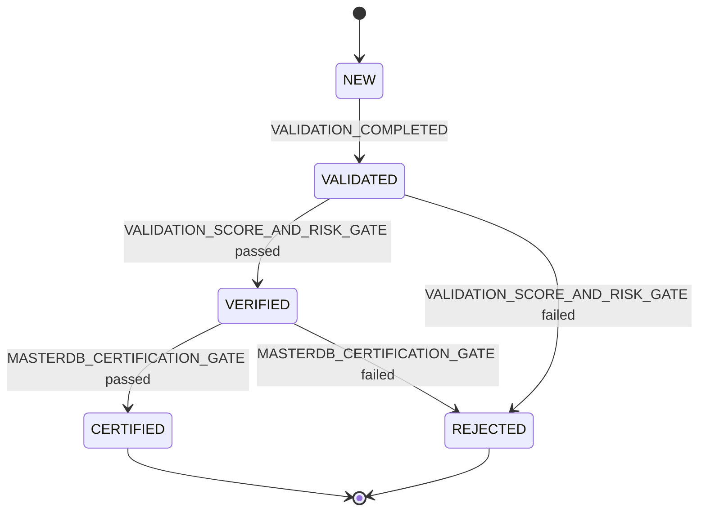

# Architecture

## Service Boundary

MASTERDB Ingestion & Certification Service is a backend capability that accepts dataset package paths and returns deterministic eligibility decisions. It does not own retrieval, embeddings, orchestration, governance, UI, or registry behavior.

## Components

## Data Flow

1. Caller submits a dataset package path and metadata path to `/validate`.
2. `ValidationService` loads schema, rules, metadata, and dataset rows.
3. Validators produce deterministic check results.
4. Engines calculate risk flags, integrity score, classification, and recommendations.
5. `ArtifactStore` persists the report by `dataset_id`.
6. Caller submits `/certify`.
7. `CertificationService` applies auditable state transition rules.
8. The service returns `eligible_for_masterdb=true` only for `CERTIFIED` datasets.

## State Machine

## Determinism

- Rules live in `config/validation_rules.json`.
- Schema expectations live in `config/schema.json`.
- Every transition is appended to `audit_trail`.
- Reports are persisted under `reports/{dataset_id}.json`.
- API responses are JSON-only.

