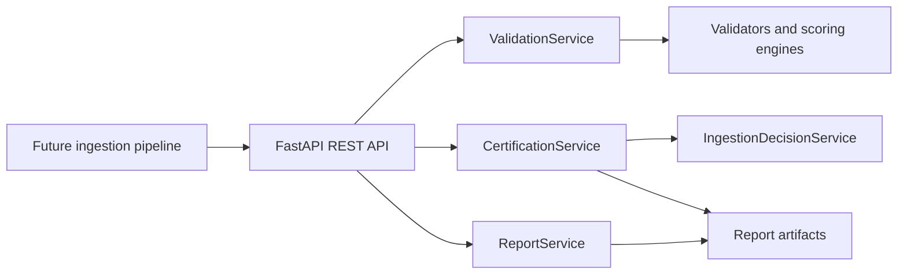

# MASTERDB Ingestion & Certification Service

Reusable backend service for deterministic MASTERDB dataset validation and certification.

This repository converts the original CSV integrity checker into a service boundary that future ingestion workflows can call without modifying validation internals. It consumes dataset packages and produces structured JSON decisions, validation artifacts, and ingestion reports.

## Scope

Owned by this service:

- Dataset validation
- Certification state transitions
- MASTERDB ingestion eligibility decisions
- Validation reports and audit artifacts
- REST API for ingestion pipelines

Out of scope:

- Retrieval
- Embeddings
- Vector databases
- RAG
- Knowledge graphs
- Registry/index systems
- UI or application orchestration

## Architecture



## Certification States

The certification engine uses deterministic, auditable transitions:

- `NEW`
- `VALIDATED`
- `VERIFIED`
- `CERTIFIED`
- `REJECTED`

`VALIDATED` means all validation checks completed and report artifacts were produced.

`VERIFIED` means the dataset clears minimum score, metadata, provenance, integrity, and risk gates.

`CERTIFIED` means the dataset is trusted, has no risk flags, and has no open recommendations. Only this state is eligible for MASTERDB ingestion.

`REJECTED` means one or more certification gates failed. Rejection reasons are returned in the decision payload.

## Install

```bash
python -m pip install -r requirements.txt
```

## Run API

```bash
uvicorn main:app --reload
```

OpenAPI documentation is available at:

- `http://127.0.0.1:8000/docs`
- `http://127.0.0.1:8000/openapi.json`

## Example Requests

Validate a dataset:

```bash
curl -X POST http://127.0.0.1:8000/validate \
  -H "Content-Type: application/json" \
  -d "{\"dataset_id\":\"sample-certified\",\"dataset_path\":\"datasets/certifiable_sample.csv\",\"metadata_path\":\"datasets/metadata.json\"}"
```

Certify a validated dataset:

```bash
curl -X POST http://127.0.0.1:8000/certify \
  -H "Content-Type: application/json" \
  -d "{\"dataset_id\":\"sample-certified\"}"
```

Get status:

```bash
curl http://127.0.0.1:8000/status/sample-certified
```

Get full report:

```bash
curl http://127.0.0.1:8000/report/sample-certified
```

## Test

```bash
python -m pytest
```

Current suite covers validation artifacts, certification success, rejection cases, and REST API responses.

## Project Structure

```text
config/                 Validation schema and rule configuration
datasets/               Sample valid and invalid dataset packages
engines/                Scoring, risk, classification, recommendation engines
profiling/              Dataset profiling
services/               Service layer and certification orchestration
tests/                  Unit and integration tests
validators/             Deterministic validation checks
main.py                 FastAPI entrypoint only
models.py               API and decision models
reports/                Generated report artifacts
```

## Key Artifacts

- `reports/sample-certified.json`
- `reports/sample-rejected.json`
- `API_DOCUMENTATION.md`
- `ARCHITECTURE.md`
- `REVIEW_PACKET.md`
- `HANDOVER.md`

