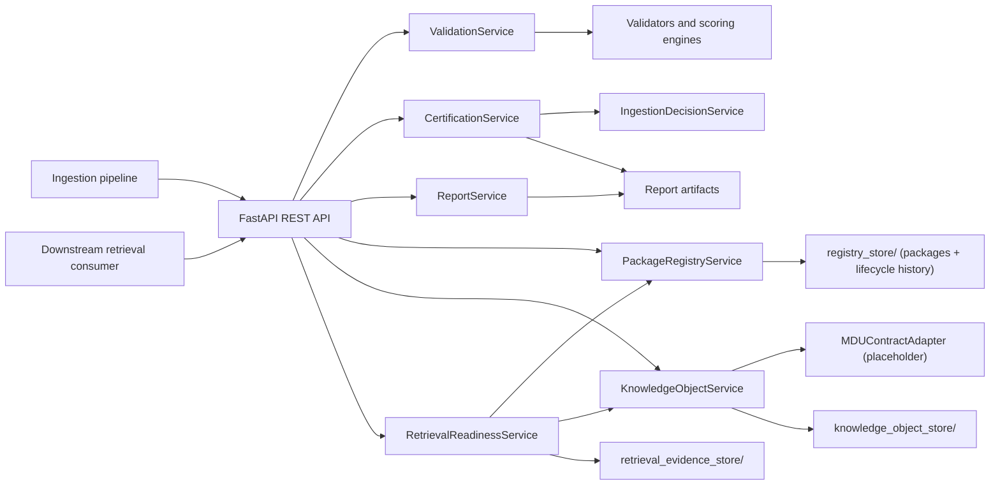
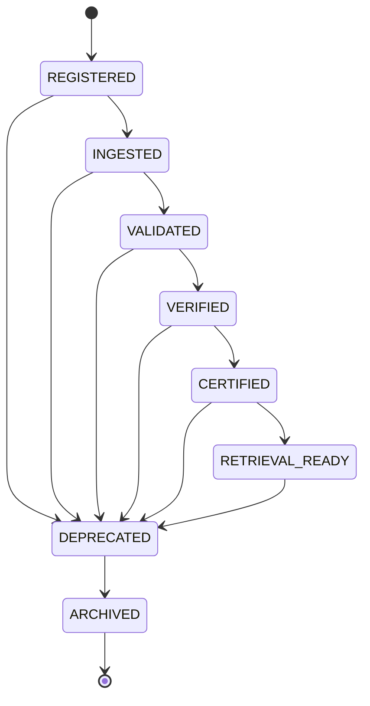
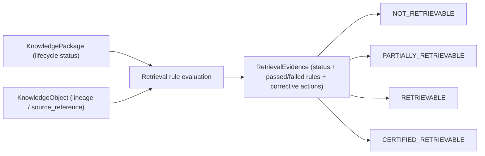

# MASTERDB — Core Knowledge Platform

Backend service for MASTERDB: deterministic dataset validation/certification
**plus** the Knowledge Package Lifecycle, Provenance/Lineage, and Retrieval
Readiness runtime that turns certification into a usable knowledge platform.

This repository started as a CSV integrity checker, became a validation and
certification boundary, and now owns package identity, lifecycle state,
lineage relationships, and retrieval eligibility for the BHIV ecosystem.
Canonical schemas, ontology, and runtime reasoning remain out of scope and
are owned by MDU (Nupur) — see `MDU_INTERFACE_CONTRACT.md`.


## Scope


Owned by this  service:

- Dataset validation
- Certification state transitions
- MASTERDB ingestion eligibility decisions
- Validation reports and audit artifacts
- Knowledge Package Lifecycle (Dataset Registry)
- Package Identity & Runtime Discovery
- Knowledge Object / Provenance consumption (adapter boundary to MDU)
- Retrieval Readiness & Retrieval Evidence
- REST API for ingestion pipelines and downstream retrieval consumers

Out of scope (owned elsewhere):

- Canonical schemas / ontology definitions (MDU)
- Knowledge authority / governance (MDU)
- Provenance & lineage semantics (MDU; MASTERDB only consumes them)
- Runtime reasoning
- Embeddings
- Vector databases
- RAG
- UI or application orchestration

## Architecture



## Package Lifecycle



Every hop records a timestamp, actor, and reason (`PackageRegistryService`),
rejects any edge not in the graph above, and can be replayed end-to-end via
`PackageRegistryService.replay()`.

## Retrieval Readiness Flow



`RETRIEVAL_READY` lifecycle status is necessary but not sufficient —
`CERTIFIED_RETRIEVABLE` also requires complete metadata and a registered
Knowledge Object with lineage. Every assessment is stored in
`retrieval_evidence_store/` and can be re-fetched via
`GET /packages/{package_id}/retrieval`.

## Certification States

The certification engine uses deterministic, auditable transitions:

- `NEW`
- `VALIDATED`
- `VERIFIED`
- `CERTIFIED`
- `REJECTED`

`VALIDATED` means all validation checks completed and report artifacts were produced.

`VERIFIED` means the dataset clears minimum score, metadata, provenance, integrity, and risk gates.

`CERTIFIED` means the dataset is trusted, has no risk flags, and has no open recommendations. Only this state is eligible for MASTERDB ingestion.

`REJECTED` means one or more certification gates failed. Rejection reasons are returned in the decision payload.

## Install

```bash
python -m pip install -r requirements.txt
```

## Run API

```bash
uvicorn main:app --reload
```

OpenAPI documentation is available at:

- `http://127.0.0.1:8000/docs`
- `http://127.0.0.1:8000/openapi.json`

## Example Requests

Validate a dataset:

```bash
curl -X POST http://127.0.0.1:8000/validate \
  -H "Content-Type: application/json" \
  -d "{\"dataset_id\":\"sample-certified\",\"dataset_path\":\"datasets/certifiable_sample.csv\",\"metadata_path\":\"datasets/metadata.json\"}"
```

Certify a validated dataset:

```bash
curl -X POST http://127.0.0.1:8000/certify \
  -H "Content-Type: application/json" \
  -d "{\"dataset_id\":\"sample-certified\"}"
```

Get status:

```bash
curl http://127.0.0.1:8000/status/sample-certified
```

Get full report:

```bash
curl http://127.0.0.1:8000/report/sample-certified
```

## Registry / Knowledge Platform Examples

Register a package:

```bash
curl -X POST http://127.0.0.1:8000/packages/register \
  -H "Content-Type: application/json" \
  -d "{\"dataset_id\":\"sample-certified\",\"dataset_version\":\"1.0.0\",\"schema_version\":\"2\",\"board\":\"AI\",\"medium\":\"text\",\"language\":\"en\",\"owner\":\"kavy\",\"actor\":\"pipeline\",\"reason\":\"Initial registration.\"}"
```

Promote it through the lifecycle:

```bash
curl -X POST http://127.0.0.1:8000/packages/promote \
  -H "Content-Type: application/json" \
  -d "{\"package_id\":\"<package_id>\",\"to_status\":\"INGESTED\",\"actor\":\"pipeline\",\"reason\":\"Ingestion complete.\"}"
```

Register a Knowledge Object (lineage) for it:

```bash
curl -X POST http://127.0.0.1:8000/packages/<package_id>/knowledge-object \
  -H "Content-Type: application/json" \
  -d "{\"package_id\":\"<package_id>\",\"source_reference\":\"s3://bucket/source.csv\",\"derivation_path\":[\"ingest\"]}"
```

Check retrieval readiness:

```bash
curl http://127.0.0.1:8000/packages/<package_id>/retrieval
```

See `API_DOCUMENTATION.md` for the full endpoint reference.

## Test

```bash
python -m pytest
```

Current suite covers validation artifacts, certification success/rejection
cases, REST API responses, package lifecycle transitions (legal/illegal),
replay validation, lineage/version compatibility, retrieval readiness
rules, and the new registry API endpoints.

## Project Structure

```text
config/                 Validation schema and rule configuration
datasets/               Sample valid and invalid dataset packages
engines/                Scoring, risk, classification, recommendation engines
profiling/              Dataset profiling
services/               Service layer: validation, certification, registry,
                        knowledge object/provenance, retrieval readiness
tests/                  Unit and integration tests
validators/             Deterministic validation checks
main.py                 FastAPI entrypoint only
models.py               API, decision, and registry/knowledge-platform models
reports/                Generated validation/certification report artifacts
registry_store/         Package registry records + lifecycle history
knowledge_object_store/ Knowledge Object / provenance records
retrieval_evidence_store/  Retrieval readiness evidence artifacts
```

## Key Artifacts

- `reports/sample-certified.json`
- `reports/sample-rejected.json`
- `API_DOCUMENTATION.md`
- `ARCHITECTURE.md`
- `REVIEW_PACKET.md`
- `HANDOVER.md`
- `MDU_INTERFACE_CONTRACT.md`

