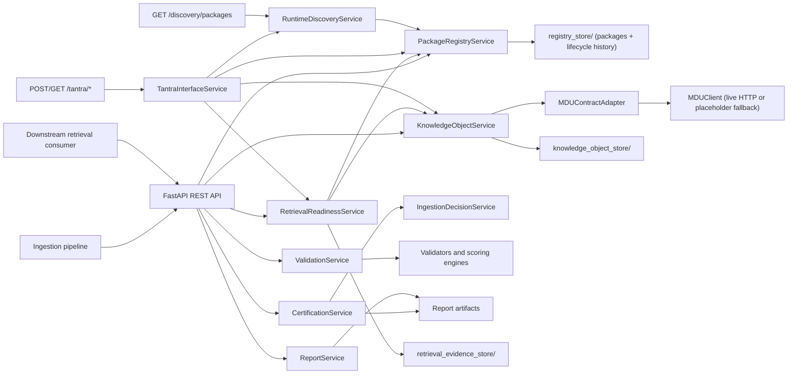
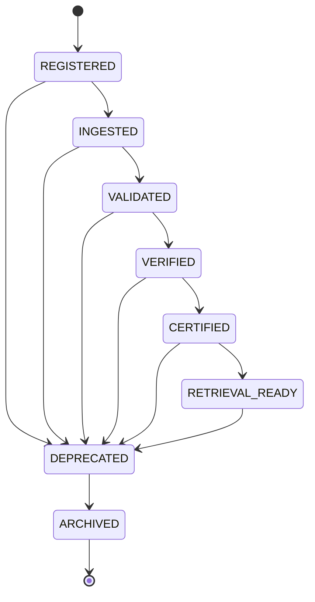
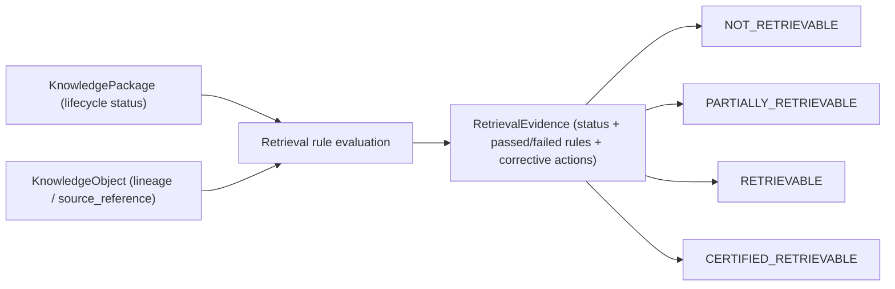

# MASTERDB — Core Knowledge Platform

Backend service for MASTERDB: deterministic dataset validation/certification
**plus** the Knowledge Package Lifecycle, Provenance/Lineage, and Retrieval
Readiness runtime that turns certification into a usable knowledge platform.


This repository started as a CSV integrity checker, became a validation and
certification boundary, then owned package identity, lifecycle state,
lineage relationships, and retrieval eligibility for the BHIV ecosystem —
and now exposes that platform as a live ecosystem capability: a real MDU
client, a MASTERDB <-> TANTRA runtime interface, and a Runtime Discovery
API, on top of the same lifecycle/lineage/retrieval logic. Canonical
schemas, ontology, and runtime reasoning remain out of scope and are owned
by MDU (Nupur) — see `MDU_INTERFACE_CONTRACT.md`.

This repo also hosts the BCAES Canonical Registry (`/bcaes/*`, ecosystem
product/capability/service catalog + production convergence tracking +
live reality snapshot) — see `BCAES_REGISTRY_ARCHITECTURE.md` for the full
design; that document is the source of truth for it.

It also hosts the BCAB/BCAES Canonical Document Repository
(`/canonical-repository/*`) — versioned, access-controlled storage for
the actual BCAB/BCAES documents (currently placeholder content, pending
central population) — see `CANONICAL_REPOSITORY_ARCHITECTURE.md`.


## Scope


Owned by this  service:

- Dataset validation
- Certification state transitions
- MASTERDB ingestion eligibility decisions
- Validation reports and audit artifacts
- Knowledge Package Lifecycle (Dataset Registry)
- Package Identity & Runtime Discovery
- Knowledge Object / Provenance consumption (adapter boundary to MDU, live
  when configured, placeholder-safe fallback otherwise)
- Retrieval Readiness & Retrieval Evidence
- MASTERDB <-> TANTRA Runtime Interface (`/tantra/*`)
- Runtime Discovery API (`/discovery/packages`)
- Replay consistency & audit completeness (`/packages/{id}/replay`,
  `/packages/{id}/audit`)
- REST API for ingestion pipelines and downstream retrieval consumers
- Shared Data Service Registry & shared operational data platform
  (`/shared/*` — Authentication, Identity, Organizations, Configuration,
  Knowledge References, Notifications; see
  `MASTERDB_SHARED_DATA_ARCHITECTURE.md`)


Out of scope (owned elsewhere):

- Canonical schemas / ontology definitions (MDU)
- Knowledge authority / governance (MDU)
- Provenance & lineage semantics (MDU; MASTERDB only consumes them)
- Runtime reasoning
- Embeddings
- Vector databases
- RAG
- UI or application orchestration

## Architecture



## Package Lifecycle



Every hop records a timestamp, actor, and reason (`PackageRegistryService`),
rejects any edge not in the graph above, and can be replayed end-to-end via
`PackageRegistryService.replay()`.

## Retrieval Readiness Flow



`RETRIEVAL_READY` lifecycle status is necessary but not sufficient —
`CERTIFIED_RETRIEVABLE` also requires complete metadata and a registered
Knowledge Object with lineage. Every assessment is stored in
`retrieval_evidence_store/` and can be re-fetched via
`GET /packages/{package_id}/retrieval`.

## Certification States

The certification engine uses deterministic, auditable transitions:

- `NEW`
- `VALIDATED`
- `VERIFIED`
- `CERTIFIED`
- `REJECTED`

`VALIDATED` means all validation checks completed and report artifacts were produced.

`VERIFIED` means the dataset clears minimum score, metadata, provenance, integrity, and risk gates.

`CERTIFIED` means the dataset is trusted, has no risk flags, and has no open recommendations. Only this state is eligible for MASTERDB ingestion.

`REJECTED` means one or more certification gates failed. Rejection reasons are returned in the decision payload.

## Install

```bash
python -m pip install -r requirements.txt
```

To enable live MDU integration (Phase 1), set these environment variables
before starting the app; without them, MDU-dependent endpoints degrade to
the documented placeholder behavior rather than failing:

```bash
export MDU_BASE_URL="https://bhiv-mdu-api.onrender.com"
export MDU_API_KEY="<the shared key>"
```

## Run API

```bash
uvicorn main:app --reload
```

OpenAPI documentation is available at:

- `http://127.0.0.1:8000/docs`
- `http://127.0.0.1:8000/openapi.json`

## Example Requests

Validate a dataset:

```bash
curl -X POST http://127.0.0.1:8000/validate \
  -H "Content-Type: application/json" \
  -d "{\"dataset_id\":\"sample-certified\",\"dataset_path\":\"datasets/certifiable_sample.csv\",\"metadata_path\":\"datasets/metadata.json\"}"
```

Certify a validated dataset:

```bash
curl -X POST http://127.0.0.1:8000/certify \
  -H "Content-Type: application/json" \
  -d "{\"dataset_id\":\"sample-certified\"}"
```

Get status:

```bash
curl http://127.0.0.1:8000/status/sample-certified
```

Get full report:

```bash
curl http://127.0.0.1:8000/report/sample-certified
```

## Registry / Knowledge Platform Examples

Register a package:

```bash
curl -X POST http://127.0.0.1:8000/packages/register \
  -H "Content-Type: application/json" \
  -d "{\"dataset_id\":\"sample-certified\",\"dataset_version\":\"1.0.0\",\"schema_version\":\"2\",\"board\":\"AI\",\"medium\":\"text\",\"language\":\"en\",\"owner\":\"kavy\",\"actor\":\"pipeline\",\"reason\":\"Initial registration.\"}"
```

Promote it through the lifecycle:

```bash
curl -X POST http://127.0.0.1:8000/packages/promote \
  -H "Content-Type: application/json" \
  -d "{\"package_id\":\"<package_id>\",\"to_status\":\"INGESTED\",\"actor\":\"pipeline\",\"reason\":\"Ingestion complete.\"}"
```

Register a Knowledge Object (lineage) for it:

```bash
curl -X POST http://127.0.0.1:8000/packages/<package_id>/knowledge-object \
  -H "Content-Type: application/json" \
  -d "{\"package_id\":\"<package_id>\",\"source_reference\":\"s3://bucket/source.csv\",\"derivation_path\":[\"ingest\"]}"
```

Check retrieval readiness:

```bash
curl http://127.0.0.1:8000/packages/<package_id>/retrieval
```

## Ecosystem Integration Examples

Check MDU schema compatibility for a registered package:

```bash
curl "http://127.0.0.1:8000/mdu/schema-compatibility/BHIV-DS-MARITIME-AIS-LIVE-001?local_schema_version=1.0"
```

Register a dataset via the TANTRA runtime interface:

```bash
curl -X POST http://127.0.0.1:8000/tantra/datasets/register \
  -H "Content-Type: application/json" \
  -d "{\"dataset_id\":\"BHIV-DS-MARITIME-AIS-LIVE-001\",\"dataset_version\":\"1.0\",\"schema_version\":\"1.0\",\"board\":\"maritime\",\"medium\":\"ais\",\"language\":\"en\",\"owner\":\"nupur\"}"
```

Runtime package lookup (bundled lifecycle + lineage + retrieval + certification):

```bash
curl http://127.0.0.1:8000/tantra/packages/<package_id>/runtime
```

Discover packages by board and lifecycle status:

```bash
curl "http://127.0.0.1:8000/discovery/packages?board=maritime&status=CERTIFIED"
```

Check replay consistency and audit completeness:

```bash
curl http://127.0.0.1:8000/packages/<package_id>/replay
curl http://127.0.0.1:8000/packages/<package_id>/audit
```

See `API_DOCUMENTATION.md` for the full endpoint reference.

## Test

```bash
python -m pytest
```

Current suite covers validation artifacts, certification success/rejection
cases, REST API responses, package lifecycle transitions (legal/illegal),
replay validation, lineage/version compatibility, retrieval readiness
rules, registry API endpoints, MDU version-negotiation logic
(`test_mdu_contract_adapter.py`), Runtime Discovery filtering/ordering
(`test_runtime_discovery_service.py`), the TANTRA façade
(`test_tantra_interface_service.py`), and audit-completeness/replay
reporting (`test_audit_and_replay.py`).

**Note on execution:** the tests above were written and syntax-checked but
could not be executed in the sandbox this was built in (no network access
to install `fastapi`/`httpx`/`pydantic`, and no reachable MDU endpoint).
Run `pip install -r requirements.txt && pytest` in a networked environment
before merging.

## Project Structure

```text
config/                 Validation schema and rule configuration
datasets/               Sample valid and invalid dataset packages
engines/                Scoring, risk, classification, recommendation engines
profiling/              Dataset profiling
shared_data/            Phase 1 — canonical Shared Data Service Registry (Task 4)
services/               Service layer: validation, certification, registry,
                        knowledge object/provenance, retrieval readiness,
                        MDU client + contract adapter, TANTRA runtime
                        interface, runtime discovery, shared data platform
                        (shared record engine, six service contracts,
                        dependency resolver, version compatibility)
tests/                  Unit and integration tests
validators/             Deterministic validation checks
main.py                 FastAPI entrypoint only
models.py               API, decision, registry/knowledge-platform, and
                        shared-record models
reports/                Generated validation/certification report artifacts
registry_store/         Package registry records + lifecycle history
knowledge_object_store/ Knowledge Object / provenance records
retrieval_evidence_store/  Retrieval readiness evidence artifacts
shared_store/           Shared dataset records (authentication, identity,
                        organizations, configuration, knowledge_references,
                        notifications), one subfolder per dataset
```

## Key Artifacts

- `reports/sample-certified.json`
- `reports/sample-rejected.json`
- `API_DOCUMENTATION.md`
- `ARCHITECTURE.md`
- `REVIEW_PACKET.md`
- `HANDOVER.md`
- `MDU_INTERFACE_CONTRACT.md`
- `MASTERDB_SHARED_DATA_ARCHITECTURE.md`

## Task 4 — Shared Data Services & MASTERDB Convergence

MASTERDB additionally exposes a **shared operational data platform** layer
(`/shared/*`) sitting between Product Databases and MDU: a canonical
registry of 15 reusable ecosystem dataset categories
(`shared_data/registry.py`), six live shared service contracts
(Authentication, Identity, Organizations, Configuration, Knowledge
References, Notifications), and version-aware, replay-safe, auditable
runtime APIs for all of them. This is additive to everything above — it
does not change certification, lifecycle, lineage, retrieval, or the
TANTRA/discovery surfaces. Full design, dependency mapping, and runtime
flows: **`MASTERDB_SHARED_DATA_ARCHITECTURE.md`**.

```text
shared_data/            Phase 1 — canonical shared dataset registry (data-only module)
services/shared_*        Phase 2/4/5 — generic record engine, six service
                         contracts, cross-service dependency resolver,
                         version-compatibility utility
shared_store/            Per-dataset JSON record storage (created on first use)
```

