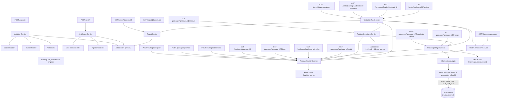
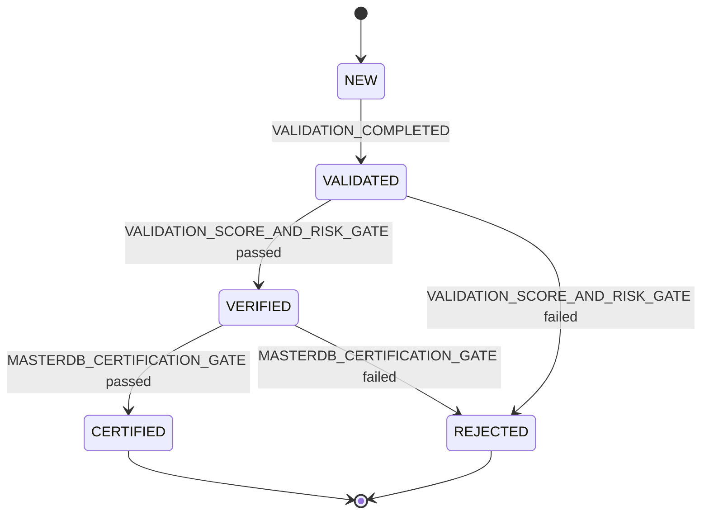
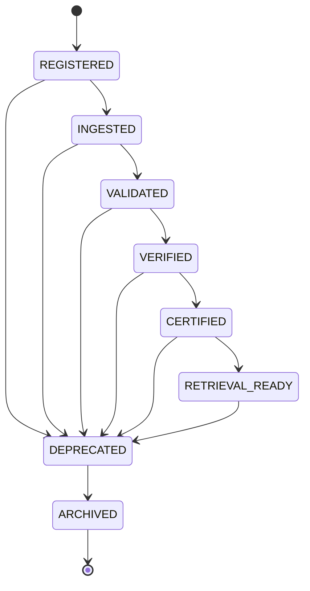
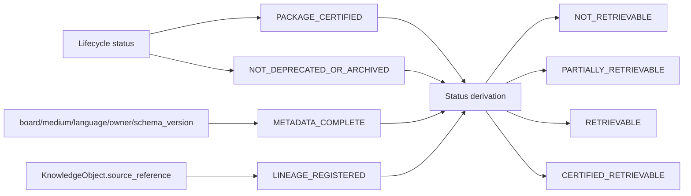

# Architecture

## Service Boundary

MASTERDB is the canonical knowledge platform runtime for the BHIV ecosystem.
It owns dataset validation/certification, Knowledge Package Lifecycle,
Dataset Registry, Package Identity, Knowledge Object/Provenance consumption,
Retrieval Readiness/Evidence, and — as of this integration sprint — the
runtime-facing surfaces that make those capabilities reachable by MDU and
TANTRA (`MDUClient`, `TantraInterfaceService`, `RuntimeDiscoveryService`). It
does not own canonical schemas, ontology, knowledge authority, governance,
runtime reasoning, embeddings, or vector databases — those are owned by MDU
(Nupur) and downstream reasoning systems (TANTRA). See
`MDU_INTERFACE_CONTRACT.md` for the consumption boundary.

## Components

## MDU Live Integration & TANTRA/Discovery Surfaces (this sprint)

- `MDUClient` (`services/mdu_client.py`) is the only module aware of MDU's
  base URL, auth header, and paths; configured via `MDU_BASE_URL` /
  `MDU_API_KEY` environment variables. `MDUContractAdapter` uses it for
  live schema/provenance fetches and degrades to the original permissive
  placeholder if MDU is unconfigured/unreachable — package registration
  and lineage reads never hard-fail purely because MDU is down.
- `TantraInterfaceService` (`services/tantra_interface_service.py`) is the
  single façade TANTRA integrates against: dataset registration, package
  discovery, retrieval-readiness queries, certification-status queries,
  and a bundled runtime package lookup. It adds no new ownership — every
  method delegates to a service MASTERDB already owns.
- `RuntimeDiscoveryService` (`services/runtime_discovery_service.py`) is a
  read-only, deterministically-ordered filter over the package registry
  (by `package_id`, `dataset_id`, `board`, `medium`, `version`, lifecycle
  `status`) — no ranking or relevance scoring, which stays out of scope.
- Phase 4 hardening: a uniform `{"error": {...}}` contract for every error
  response (see `API_DOCUMENTATION.md`), structured logging on registration/
  transitions/MDU calls, and two new endpoints —
  `GET /packages/{id}/replay` and `GET /packages/{id}/audit` — that make
  replay-consistency and audit-completeness independently queryable rather
  than only exercised internally by `RetrievalReadinessService`.

## Data Flow — Validation & Certification

1. Caller submits a dataset package path and metadata path to `/validate`.
2. `ValidationService` loads schema, rules, metadata, and dataset rows.
3. Validators produce deterministic check results.
4. Engines calculate risk flags, integrity score, classification, and recommendations.
5. `ArtifactStore` persists the report by `dataset_id`.
6. Caller submits `/certify`.
7. `CertificationService` applies auditable state transition rules.
8. The service returns `eligible_for_masterdb=true` only for `CERTIFIED` datasets.

## Data Flow — Knowledge Package Lifecycle & Retrieval Readiness

1. Caller registers a `KnowledgePackage` via `/packages/register`, receiving
   a `package_id` and an initial `REGISTERED` transition record.
2. Caller promotes the package through `/packages/promote`;
   `PackageRegistryService` checks the requested edge against
   `PACKAGE_LIFECYCLE_GRAPH`, rejects illegal hops, and appends a
   timestamped, attributed `PackageTransition` on success.
3. Optionally, a `KnowledgeObject` is registered via
   `/packages/{package_id}/knowledge-object`, carrying `source_reference`,
   `lineage_reference`, and `derivation_path`. `KnowledgeObjectService`
   validates the declared parent exists, checks major-version schema
   compatibility, and keeps parent/child relationships in sync. Field
   semantics are consumed through `MDUContractAdapter`, a placeholder
   pending MDU's finalized contract.
4. `/packages/{package_id}/lineage` walks the `KnowledgeObject` parent chain
   to return ancestors and declared descendants.
5. `/packages/{package_id}/retrieval` runs `RetrievalReadinessService`,
   which evaluates lifecycle status, deprecation, metadata completeness, and
   lineage presence to produce a `RetrievalEvidence` artifact — persisted
   and replayable — with a `RetrievalStatus` and corrective actions for any
   failed rule.
6. `PackageRegistryService.replay()` independently rebuilds a package's
   status from its full transition history to detect drift between stored
   state and the audit trail that justifies it.

## State Machines

### Certification (existing)

### Knowledge Package Lifecycle (new)

`ARCHIVED` is terminal — no outgoing edges. `DEPRECATED` is reachable from
every non-terminal state so a package can be withdrawn at any point in its
life, and is the only path into `ARCHIVED`.

### Retrieval Readiness Rule Evaluation

## Determinism

- Rules live in `config/validation_rules.json`.
- Schema expectations live in `config/schema.json`.
- Every certification transition is appended to `audit_trail`.
- Every lifecycle transition is appended to a package's `history` with
  actor, reason, and timestamp, and is rejected if not present in
  `PACKAGE_LIFECYCLE_GRAPH`.
- Retrieval readiness assessments are recomputed deterministically from
  current lifecycle status and knowledge object state, and persisted as
  replayable evidence.
- Reports/records are persisted under `reports/`, `registry_store/`,
  `knowledge_object_store/`, and `retrieval_evidence_store/` respectively.
- `RuntimeDiscoveryService` results are always sorted by `package_id`, so
  identical filter queries against identical on-disk state return
  byte-for-byte identical responses.
- API responses are JSON-only, and every error response uses the uniform
  `{"error": {"type", "message", "path"}}` contract described in
  `API_DOCUMENTATION.md`.
- **Live-MDU caveat**: `MDUContractAdapter`'s schema-compatibility and
  provenance/lineage responses are only as deterministic as MDU's own
  service — when live, MASTERDB passes through whatever MDU currently
  returns rather than caching a frozen snapshot. Replay of a package's
  *own* lifecycle history remains fully deterministic regardless of MDU's
  availability.

## Task 4 — Shared Data Platform Layer

A parallel, additive architecture sits alongside everything above:
`shared_data/registry.py` (pure data — 15 dataset definitions) feeds
`SharedDataRegistryService` (read-only query layer). Six dataset-specific
services (`services/shared_platform_services.py`) are thin subclasses of
one generic engine, `SharedRecordStore` (`services/shared_record_store.py`),
which is the same versioned/audited/replay-safe pattern
`PackageRegistryService` already established for packages — reused here so
Task 4 does not invent a second persistence philosophy. Cross-service
dependency resolution (`services/shared_dependency_resolver.py`) and
generic version negotiation (`services/shared_version_compatibility.py`)
are the only pieces of logic layered on top of the generic engine, and
both are dataset-agnostic (no per-dataset business rules). Full detail:
`MASTERDB_SHARED_DATA_ARCHITECTURE.md`.

